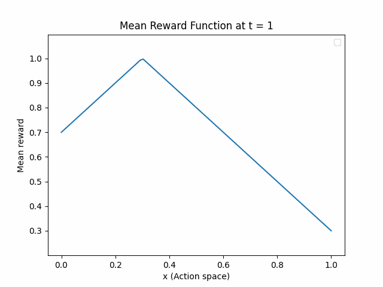
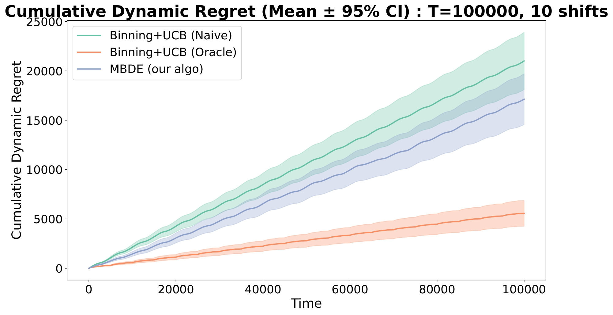

# Code for Non-Stationary Lipschitz Bandits

Anonymous repo for the Neurips submission `#1681 : Non-stationary Lipschitz Bandits`.

## Repository Structure

``` shell
├── Dyadic.py        # Code for binary tree structure (dyadic trees of bins).
├── Policy.py        # Code for bandit policies (our algo + benchmark).
├── Environment.py   # Code for bandit environment (mean values functions).
├── Results/         # Numerical results.
```

## Synthetic Experiments

### Bandit Environment
We simulate a non-stationary bandit environment over a time horizon of `T = 100,000`, where the mean reward function evolves over time. We consider *Bernoulli bandits*.
In particular, we have $L_T=\mathcal{O}(T)$ and $V_T = \mathcal{O}(T)$. The environment uses a mean reward that cyclically shift between two distinct optima:
- **Peak at `x₁ = 0.3`**.
- **Peak at `x₂ = 0.7`**.
  
This transition occurs **10 times** throughout the time horizon. The mean reward function at each time step is **1-Lipschitz** with respect to the arm space `x ∈ [0, 1]`.

Below are animations illustrating the evolution of the mean reward function over time. Each frame shows the reward as a function of the arm space `x` at a particular time step.




### Numerical Results

We evaluate the performance of our algorithm `MBDE` by plotting its dynamic regret, and we report the standard 95% confidence intervals averaged over `NB_ITER = 100` independent runs.

Since there is no existing algorithm designed for non-stationary Lipschitz bandits, we compare MBDE against these two benchmark baselines:

- `Binning+UCB (Naive)`: Discretizes the arm space into $K(T) = \mathcal{O}(T^{1/3})$ arms and applies the standard UCB algorithm naively across all time steps, without adapting to changes in the reward function.

- `Binning+UCB (Oracle)`: Assumes knowledge of the true change points $\tau_i$'s. For each stationary phase $[\tau_{i}, \tau_{i+1}[$ (see Definition 2 in our paper), it discretizes the arm space into $K_i = \mathcal{O}(\tau_{i+1} - \tau_i)^{1/3}$ arms and runs a fresh instance of UCB within that phase. All estimates are reset at the end of each phase.

The figure below shows how MBDE compares to these benchmarks over time:



